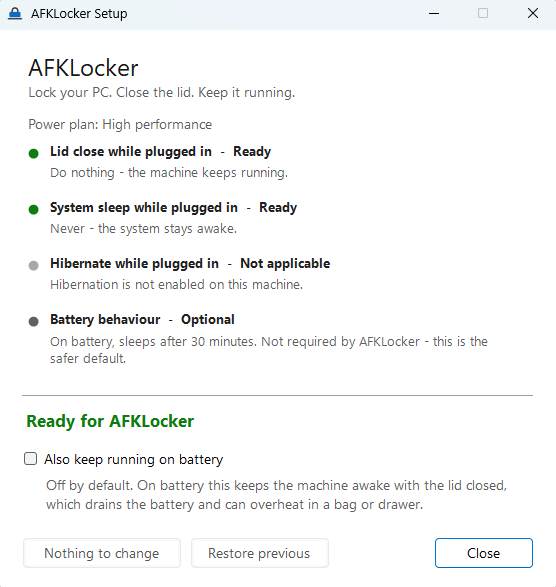

<div align="center">


# AFKLocker

**Lock your PC. Close the lid. Keep it running.**

AFKLocker is a small Windows utility for people who need their laptop to keep working while
they're away. It prepares Windows for closed-lid operation and gives you a one-action way to
lock the session before you leave.

[](https://github.com/augbastos/AFKLocker/actions/workflows/ci.yml)
[](LICENSE)


</div>

---

## Two ways to lock

**Manual** — the default. Nothing of AFKLocker stays running.

```
Double-click AFKLocker
        ↓
Windows locks
        ↓
Close the lid
        ↓
Work keeps running
```

**Automatic** — opt-in. Closing the lid is itself the instruction to lock.

```
Close the lid
        ↓
AFKLocker locks Windows
        ↓
Work keeps running
```

Manual remains the default because AFKLocker does not need to stay resident to do its job.
Automatic mode is there for people who move between places often and want lid-close itself to
mean "lock and keep working". You turn it on in AFKLocker Setup; it is never enabled by
installing.

---

## Why AFKLocker

Closing a laptop lid normally means "stop". That is the right default for most people and the
wrong one if the machine is doing something.

If you leave a build, a download, a local server, an SSH session, a long sync or an agent
running, walking away has three bad options: leave the machine unlocked, let it go to sleep, or
learn Windows power configuration well enough to change the defaults safely. Windows can be told
to keep running with the lid closed, but the settings are spread across several pages, they are
easy to get half-right, and nothing tells you whether you actually got it right.

AFKLocker is that missing piece:

- **It checks.** One window tells you whether Windows will really keep this machine running with
  the lid closed, or which setting would still suspend it.
- **It configures.** With your confirmation, and remembering the previous values so you can undo it.
- **It locks.** Double-click, the session locks, done. No window, no prompt, no timer.

The daily experience is a single double-click. Everything else is one-time setup.

## How it works

There are two separate things people confuse:

| | What it does | What happens to your work |
|---|---|---|
| **Locking the session** | Shows the lock screen, requires your password to return | Everything keeps running |
| **Sleep / suspend** | Powers down the machine to a low-power state | Everything stops |

AFKLocker wants the first and avoids the second. It calls `LockWorkStation` - and nothing else
at that moment. No processes are paused, no services stopped, no network connections dropped.

The part that makes closed-lid work possible is not the lock. It's the power configuration:

1. **Lid close action = Do nothing**, so shutting the laptop doesn't suspend it.
2. **System sleep timeout = Never**, so idling doesn't suspend it either.
3. **Nothing stays resident.** AFKLocker exits immediately after locking. The machine keeps
   running because Windows is configured to, not because something is holding it awake.

The screen going dark is handled by the hardware: closing the lid physically turns the panel and
keyboard backlight off. AFKLocker deliberately does *not* try to blank the display in software at
lock time - the Windows lock screen turns the monitor back on by itself, so that approach fights
the OS and loses. Closing the lid is the reliable way to get a dark screen.

## Quick start

1. Download the installer from [Releases](https://github.com/augbastos/AFKLocker/releases).
2. Run it. You get an **AFKLocker** shortcut on your desktop.
3. Open **AFKLocker Setup** and check the readiness list. Apply the configuration if it asks you to.
4. From then on: **double-click AFKLocker**, close the lid, walk away.

## Installation

**Installer (recommended)** - grab `AFKLocker-<version>-setup.exe` from the
[latest release](https://github.com/augbastos/AFKLocker/releases/latest). It installs for the
current user by default, so it does not need administrator rights.

**Portable** - the release also contains a zip with the three binaries. Unzip anywhere and run
`AFKLocker.exe`. You create your own shortcut; nothing is written outside
`%LOCALAPPDATA%\AFKLocker`, and that only appears once you let Setup change a power setting.

> **About the SmartScreen warning:** the binaries are not code-signed - a code signing certificate
> is a recurring cost this project does not have. Windows SmartScreen will therefore show
> "Windows protected your PC" on first run. You can click **More info → Run anyway**, or build
> from source (see below) if you'd rather not trust a binary you didn't compile. This is stated
> plainly here because you deserve to know before you download, not after.

## Setup

`AFKLocker Setup` reads your active power plan and reports one line per thing that matters:

<div align="center">
  
</div>

If something needs changing, the button tells you exactly what it will do before it does it. If
nothing needs changing, the button says **Nothing to change** and stays disabled - AFKLocker does
not rewrite settings that are already correct.

**Battery is opt-in and off by default.** Keeping a laptop awake with the lid closed on battery
drains it and can overheat it. Setup will report what your battery settings do, but it will not
change them unless you tick the box.

## Usage

| Action | What happens |
|---|---|
| Double-click **AFKLocker** | The session locks immediately. No window appears. |
| `AFKLocker.exe --display-off` | Turns the display off without locking. Any key or mouse move brings it back. |
| **AFKLocker Setup** | Readiness, lock behaviour, restore. |

The `--display-off` shortcut is optional at install time (unticked by default). It is useful on a
desktop, or when you want the screen off but are staying at the machine.

## Automatic lid lock

Switch **Lock behaviour** to **Automatic** in Setup and closing the lid locks Windows by itself.

Here is the case it exists for. You are working somewhere public — a library, a café, a shared
office. A build is running, or a download, or a server, or an agent. You shut the laptop, walk to
another room, and open it again: Windows asks for your PIN, and everything you left running is
still running, in the same session, exactly where it was.

**What turning it on actually does:**

- A small process, `AFKLockerWatcher.exe`, starts when you sign in. It has no window, no tray
  icon and no console.
- It asks Windows to tell it when the lid moves (`GUID_LIDSWITCH_STATE_CHANGE`) and then sleeps.
  There is no polling: it is blocked in a message loop until Windows posts an event. Idle, it
  holds around 5 MB and uses no measurable CPU.
- When the lid closes, it calls `LockWorkStation`. That is the entire job.

**What it deliberately does not do:**

- **It never unlocks.** Opening the lid leaves Windows on the lock screen. Every time.
- **It does not touch power settings** and does not keep the machine awake by itself. Staying
  awake with the lid shut is the job of the settings above; these are two separate things, and
  Setup shows them separately for that reason.
- **It does not watch what you are running**, or care when it finishes.

Turn it off and the watcher stops, the sign-in entry is removed, and nothing of AFKLocker is
resident again. Uninstalling does the same, without asking.

**Two details worth knowing:**

- The first lid event after the watcher starts is treated as a starting position, not a change,
  so it never locks on its own. This matters if you work with the laptop docked and shut on an
  external monitor — starting the watcher there will not lock you out.
- Automatic lock works regardless of your battery settings, but if Windows is still set to sleep
  when the lid closes on battery, it will lock and *then* sleep. Setup says so when that applies.

For diagnostics: `AFKLockerWatcher.exe --status` reports the mode, whether a watcher is running,
and the autostart entry; `--stop` asks a running one to exit.

## Power settings AFKLocker changes

Only these, only on the active power plan, and only after you confirm:

| Setting | Windows GUID | Set to | When |
|---|---|---|---|
| Lid close action (AC) | `5ca83367-…` | Do nothing | Always |
| System sleep timeout (AC) | `29f6c1db-…` | Never | Always |
| Hibernate timeout (AC) | `9d7815a6-…` | Never | Only if hibernation is enabled |
| Lid close action (DC) | `5ca83367-…` | Do nothing | Only if you tick "also on battery" |
| System sleep timeout (DC) | `29f6c1db-…` | Never | Only if you tick "also on battery" |
| Hibernate timeout (DC) | `9d7815a6-…` | Never | Only if you tick "also on battery" |

**The display timeout is never touched.** AFKLocker keeps the *system* awake, not the *screen*.
Your monitor can and should still turn off on its own.

**The automatic-lock watcher changes none of these.** It only locks. Whether the machine keeps
running with the lid shut is decided entirely by the table above, in both modes.

Settings are read and written through the documented `powrprof.dll` power scheme API
(`PowerReadACValueIndex`, `PowerWriteACValueIndex`, `PowerSetActiveScheme`), not by parsing
`powercfg.exe` output - that output is localized, so parsing it breaks on every non-English
Windows.

## Restore and uninstall

Before changing anything, AFKLocker writes the previous values to a plain-text file in
`%LOCALAPPDATA%\AFKLocker\`, one file per power plan:

```
# AFKLocker power settings backup
version=1
scheme=8c5e7fda-e8bf-4a96-9a85-a6e23a8c635c
scheme-name=High performance
lid-ac=1
sleep-ac=1800
```

You can read it, and so can anyone troubleshooting your machine.

- **Restore previous** in AFKLocker Setup puts those values back and removes the backup.
- **Uninstalling** asks whether you want them restored first. Say no and the machine stays
  configured for closed-lid operation - a perfectly reasonable thing to want.

Two details that matter:

- Running Setup twice never overwrites the original backup. The first recorded value is the one
  that predates AFKLocker, and that's the one restore uses.
- Restore targets the power plan the backup came from, not whichever plan happens to be active
  now. Switching plans between configure and uninstall doesn't confuse it.

## Safety

**Never leave a running, lid-closed laptop inside a bag, sleeve, drawer, backpack or any other
poorly ventilated enclosure.** A machine that isn't sleeping is still generating heat, and a
closed space traps it. This is the one rule to take seriously, and automatic mode makes it matter
more: when lid-close means "lock", it stops being a deliberate decision to leave the machine
running, and starts being a habit.

|  | |
|---|---|
| **Fine** | Closed on a desk. Carried briefly in open air. Under your arm with the vents clear. |
| **Don't** | Closed inside a backpack or padded sleeve while a build runs. Any confined space. Anything that blocks the vents. |

This is not a guarantee about your particular hardware. Thermal behaviour varies by model,
ambient temperature and workload; when in doubt, be conservative and let the machine sleep.

Also worth knowing:

- **Battery drain.** On battery, keeping the system awake will flatten it, and a machine that dies
  mid-task loses whatever wasn't saved. This is why battery configuration is opt-in.
- **Thermals.** A laptop running a build with the lid closed on a soft surface that blocks its
  vents will throttle, and may shut down to protect itself.
- **Physical security.** A locked session is a real barrier, but a machine left running in a public
  space is still a machine left in a public space.
- **OEM software can override you.** Some vendor power utilities re-apply their own settings, and
  managed machines may have Group Policy that blocks changes entirely. If AFKLocker's checks say
  Ready but the machine still sleeps, suspect that first.

## Compatibility

- **Windows 10 and Windows 11.** Windows 8.1 should work; it hasn't been tried.
- Requires **.NET Framework 4.8**, which ships with Windows 10 (1903+) and Windows 11. There is no
  runtime to install.
- **Physically tested on one machine**: an Acer Nitro AN515-45 laptop running Windows 11 Home,
  with hibernation disabled and classic S3 standby. Everything else is covered by unit tests
  against simulated machines, not by hardware.

That's the honest scope. It's a small utility that talks to a well-documented Windows API, so it
should behave the same elsewhere - but "should" is not "was tested", and this README isn't going
to pretend otherwise.

## Limitations

- **Modern Standby (S0 low power idle) machines are a known gap.** On these, the classic sleep
  timeouts are not the whole story and the system can still drop into a low-power state with the
  lid closed. AFKLocker detects Modern Standby and says so instead of promising it will work.
- **Some firmware reports no lid at all.** `SYSTEM_POWER_CAPABILITIES.LidPresent` comes back false
  on machines that obviously have one - including the laptop this was built on. AFKLocker
  therefore keys its checks off the presence of the lid close *setting*, not that flag.
- **Group Policy wins.** On a managed machine, writes may be refused. Setup reports that clearly
  and offers to retry elevated, but it cannot overrule policy.
- **It doesn't watch anything.** AFKLocker has no idea what you're running, when it finishes, or
  whether you came back. It configures the machine and locks the session. That's the whole product.

Specific to automatic mode:

- **Automatic lock needs a machine that reports lid events.** Windows only delivers them "until a
  lid device is found and its current state is known" - so on a desktop, or a machine whose lid
  device is disabled, nothing will ever fire. Setup detects this and says so, because the failure
  is otherwise invisible: the watcher reports itself as perfectly healthy and simply never does
  anything.

  The usual cause on a laptop is the **ACPI Lid** device being disabled in Device Manager (under
  *System devices*). Disabling it is an old trick for stopping a laptop sleeping when the lid
  closes - which AFKLocker makes unnecessary, since it configures the lid action properly instead.
  Enabling it again is safe once the lid action is "Do nothing", and it is what makes automatic
  lock possible.
- **The watcher lives in your session.** It starts at sign-in and ends at sign-out. It does not
  run at the lock screen before you have signed in, and it does not cover other users - each
  signed-in user gets their own, or none.
- **Automatic mode does not make an unsupported machine work.** If Modern Standby or an OEM
  utility puts the machine to sleep when the lid closes, AFKLocker will lock it first and Windows
  will sleep it anyway.

## Privacy

AFKLocker makes **no network requests of any kind**. No telemetry, no analytics, no update check,
no accounts, no cloud anything. That is unchanged by automatic mode: the watcher opens no sockets
either.

Everything it touches is local: Windows power settings, backup and settings files under
`%LOCALAPPDATA%\AFKLocker\`, one registry value under `HKCU\...\CurrentVersion\Run` when automatic
mode is on, and `LockWorkStation`.

You do not have to take that on faith. The logic is a handful of readable source files, and the
repository's own integration test checks the running watcher for open TCP/UDP handles and power
requests rather than just asserting there are none.

## Building from source

No SDK to install: AFKLocker compiles with the C# compiler that ships with the .NET Framework, so
a clean Windows machine can build it as-is.

```powershell
git clone https://github.com/augbastos/AFKLocker.git
cd AFKLocker
pwsh -File tools/Build.ps1 -Test
```

Output lands in `build/`. Useful switches:

```powershell
pwsh -File tools/Build.ps1 -Test -Installer   # also build the installer (needs Inno Setup 6)
pwsh -File tools/Build-Icon.ps1               # regenerate the icon assets from their vector source
```

Two integration scripts are kept out of CI because they touch the real machine, and are worth
running by hand after changing anything they cover:

```powershell
pwsh -File tools/Test-Integration.ps1           # applies and restores power settings, on a throwaway power plan
pwsh -File tools/Test-AutoLock-Integration.ps1  # turns automatic lock on and off for real, then puts it back
```

The build treats compiler warnings as errors, and `tools/Build-Icon.ps1` regenerates every icon
size from one geometric definition, so the assets in `assets/` are reproducible rather than
hand-drawn artefacts.

See [docs/architecture.md](docs/architecture.md) for why it's built this way.

## License

MIT - see [LICENSE](LICENSE).
